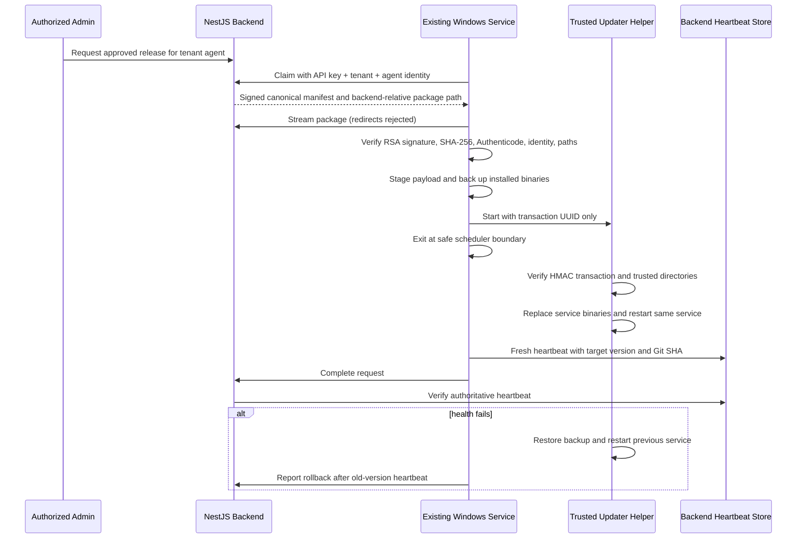

# Windows In-Place Update Architecture

## Components and Trust Boundaries

## State Machine

`approved → claimed → downloading → verifying → staged → waiting_for_window → installing → restarting → verifying_health → completed`

Failure branches:

- Preparation failure: `failed`, local/backend release suppression.
- New-build health failure: `rollback_started → rolled_back`.
- Rollback failure: `failed` with `ROLLBACK_FAILED`; evidence remains under ProgramData.
- Cancellation is allowed only before installation begins.

## Trust Decisions

- The dashboard selects only a backend release ID and `now` or `maintenance`; it cannot submit URLs, paths, service names, certificates, executables, or commands.
- Agent authentication is the existing API key plus required tenant ID. Tenant is derived by `SyncApiKeyGuard`.
- Package location is a signed backend-relative `/api/sync-agent/releases/.../package` path.
- Downloads use HTTPS, the configured backend/allowlisted hosts, no redirects, bounded size, timeout, streaming, and atomic completion.
- The helper accepts only `--transaction <UUID>`. Paths and the service name come from a DPAPI/HMAC-protected transaction.
- The existing service, scheduler, agent ID, API key, JTL settings, watermarks, logs, and command history remain unchanged.

## Capability Negotiation

The new agent heartbeat reports `safeUpdate=true` and `updateProtocolVersion=2`. Backend and UI hide update actions for legacy agents. Feature flags remain off until the signed bridge pilot is approved.
